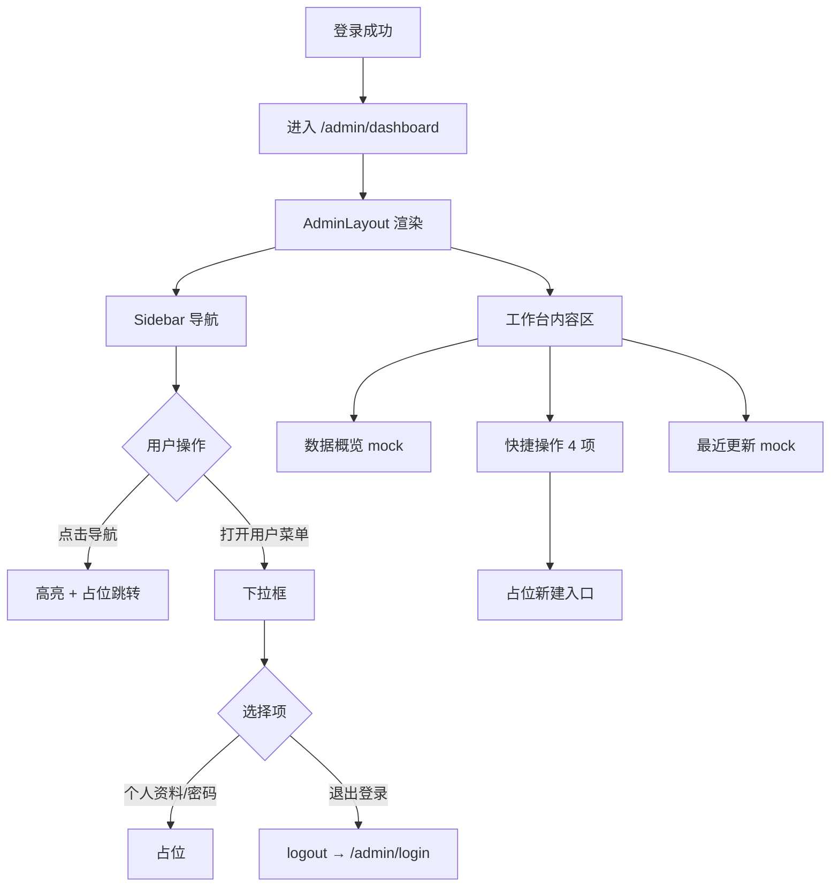

# 业务流程

## 1. 流程总览

```text
用户登录成功（REQ-0001）
  ↓
跳转 /admin/dashboard
  ↓
展示 AdminLayout（Sidebar + 工作台内容）
  ↓
用户可：
  ├─ 浏览数据概览（mock）
  ├─ 点击快捷操作（占位）
  ├─ 查看最近更新（mock）
  ├─ 通过 Sidebar 切换模块（占位）
  └─ 通过用户菜单退出或访问个人设置（占位）
```

## 2. 进入首页主流程

```text
POST /api/v1/auth/login 成功
  ↓
前端保存登录态，role in [admin, employee]
  ↓
navigate('/admin/dashboard')
  ↓
ProtectedRoute 校验通过
  ↓
AdminLayout 渲染
  ├─ 左侧 AdminSidebar（264px, 100vh, sticky）
  └─ 右侧 DashboardPage（100vh, overflow auto）
        ├─ 数据概览（4 指标卡）
        ├─ 快捷操作（4 宫格）
        └─ 最近更新（表格）
```

### 2.1 与登录需求的衔接

| 步骤 | 来源 | 说明 |
|---|---|---|
| 登录成功跳转 | REQ-0001 | 默认去向 `/admin/dashboard` |
| 路由守卫 | REQ-0001 | 未登录访问 dashboard 跳转 `/admin/login` |
| 用户信息 | REQ-0001 | `GET /api/v1/auth/me` 提供 display_name、email 等 |
| 退出登录 | REQ-0001 | 用户菜单下拉框触发 logout |

## 3. Sidebar 导航流程

```text
用户点击 Sidebar 导航项
  ↓
当前项高亮（active 态，品牌金弱强调）
  ↓
本期实现策略（待 OpenSpec design 确认）：
  ├─ 「首页」→ 停留 /admin/dashboard
  └─ 其他项 → 占位路由 / 功能建设中提示
```

### 3.1 导航分组

**OPERATIONS**

- 首页 → `/admin/dashboard`
- 瓷砖 SKU → 占位（后续 REQ）
- 瓷砖品牌 → 占位
- 瓷砖类目 → 占位
- Banner 管理 → 占位

**SYSTEM**

- 用户管理 → 占位
- 系统设置 → 占位

## 4. 用户菜单流程

```text
用户点击 Sidebar 底部用户菜单按钮
  ↓
下拉框在用户按钮上方展开（aria-expanded=true）
  ↓
用户选择菜单项
  ├─ 个人资料 → 占位页 / 功能建设中（本期）
  ├─ 密码修改 → 占位页 / 功能建设中（本期）
  └─ 退出登录 → 调用 logout → 跳转 /admin/login
```

### 4.1 退出登录与 REQ-0001 差异

REQ-0001 验收要求退出入口在「管理端顶部菜单」。本需求将退出收纳至 Sidebar 底部用户下拉框，**替代**原 AdminLayout 顶栏退出按钮布局。实现时需同步更新 REQ-0001 相关 UI 验收或记录为 MODIFIED。

## 5. 快捷操作流程

```text
用户点击快捷操作卡片
  ↓
本期：跳转占位页或 toast「功能建设中」
  ↓
后续迭代（不在本 REQ 范围）：
  ├─ 新增 SKU → SKU 创建页
  ├─ 新增品牌 → 品牌创建页
  ├─ 新增类目 → 类目创建页
  └─ 新增 Banner → Banner 创建页
```

## 6. 数据展示流程（本期 mock）

```text
DashboardPage 挂载
  ↓
读取静态/mock 数据源
  ├─ 指标卡：SKU 12860、品牌 128、Banner 36、用户 42
  └─ 最近更新：5 条样例行（与 HTML 原型一致）
  ↓
渲染页面
  ↓
（后续迭代）替换为真实 API：
  GET /api/v1/admin/dashboard/summary
  GET /api/v1/admin/dashboard/recent-updates
```

## 7. 响应式流程

```text
视口宽度 >= 1024px（桌面）
  → 264px Sidebar + 右侧滚动内容；用户菜单可见

视口宽度 < 1024px
  → Sidebar 变为顶部区域；用户菜单隐藏（按原型 context）

视口宽度 < 640px
  → 指标卡/快捷操作单列；表格隐藏操作人列
```

## 8. 本期不包含的流程

- 真实统计数据聚合与缓存。
- 审计日志写入与「最近更新」接口。
- SKU/品牌/类目/Banner 创建表单完整流程。
- 个人资料编辑、密码修改完整流程。
- 移动端 Sidebar 抽屉交互（仅按原型做基础降级）。

## 9. 流程图（Mermaid）


