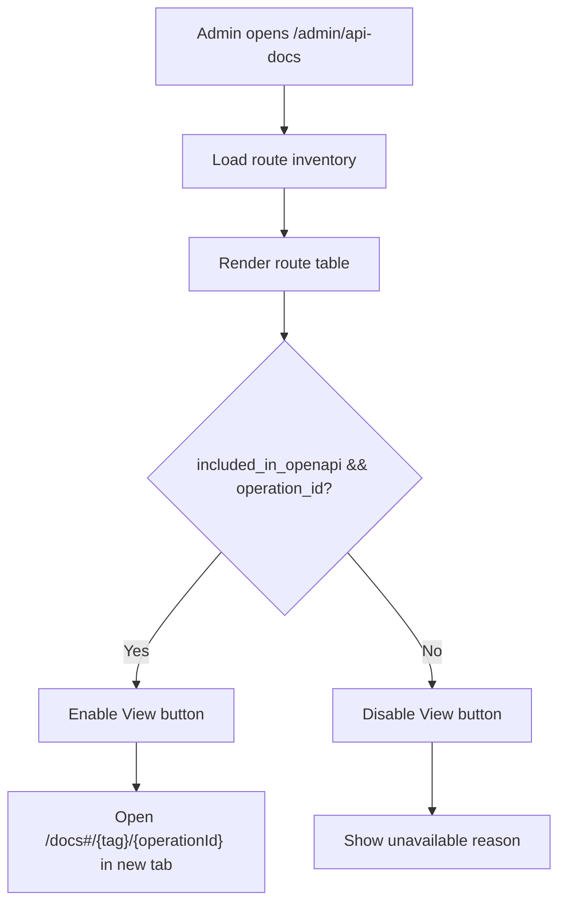

# Business Flow

## 1. 主流程

```text
管理员进入 /admin/api-docs
  ↓
页面加载接口目录
  ↓
管理员筛选或搜索接口
  ↓
查看接口行
  ├─ included_in_openapi=true 且 operation_id 存在
  │   ↓
  │  展示可点击「查看」
  │   ↓
  │  新窗口打开 /docs#/{tag}/{operationId}
  │   ↓
  │  Swagger UI 定位到接口详情
  │
  └─ included_in_openapi=false 或 operation_id 缺失
      ↓
     展示禁用态「查看」
      ↓
     提示无 Swagger 详情，不跳转
```

## 2. 与父需求差异

```text
REQ-0022
  ├─ 提供 /admin/api-docs 页面
  ├─ 展示接口目录、OpenAPI 状态、Orval 方法名
  └─ 提供 Swagger UI 全局入口

REQ-0023
  ├─ 不新增接口文档主入口
  ├─ 不改变权限边界
  ├─ 在接口表格行内新增 ACTION 列
  └─ 从具体接口行深链到 Swagger operationId
```

## 3. Swagger 链接生成策略

```text
route.tag + route.operation_id
  ↓
校验 included_in_openapi
  ↓
校验 operation_id 非空
  ↓
encode tag / operation_id
  ↓
生成 /docs#/{tag}/{operationId}
```

实现阶段 MUST 验证当前 FastAPI Swagger UI 的实际 deepLinking 格式。若实际锚点格式与上方示例不同，OpenSpec `design.md` MUST 记录并以验证后的格式为准。

## 4. 鉴权上下文

```text
当前管理端页面
  ├─ 保持当前登录态
  ├─ 保持筛选条件
  ├─ 保持滚动/列表上下文
  └─ 不向 Swagger URL 注入 token

新窗口 Swagger UI
  ├─ 使用后端 /docs 当前环境策略
  ├─ 非生产可 Try It Out
  └─ 生产环境仍只读或禁用 Try It Out
```

## 5. 异常与降级

| 场景 | 行为 |
|---|---|
| `included_in_openapi=false` | 禁用「查看」，不生成 href |
| `operation_id` 为空 | 禁用「查看」，提示 OpenAPI 未提供 operationId |
| Swagger UI 不可达 | 不在表格行内预检测；打开后的目标页负责呈现失败 |
| 浏览器阻止弹窗 | 使用标准 `<a target="_blank">` 链接，允许用户再次点击 |

## 6. Mermaid 视图


